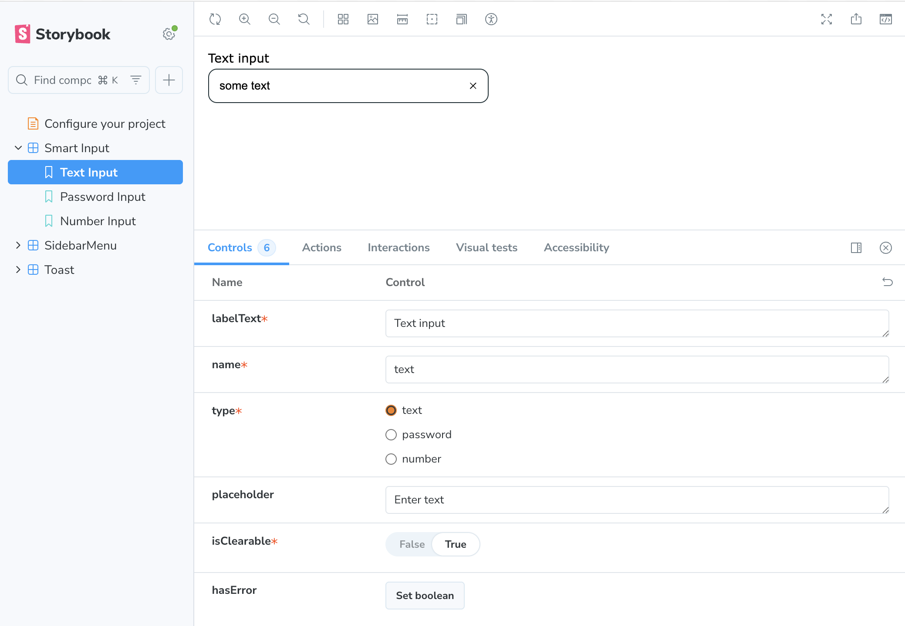
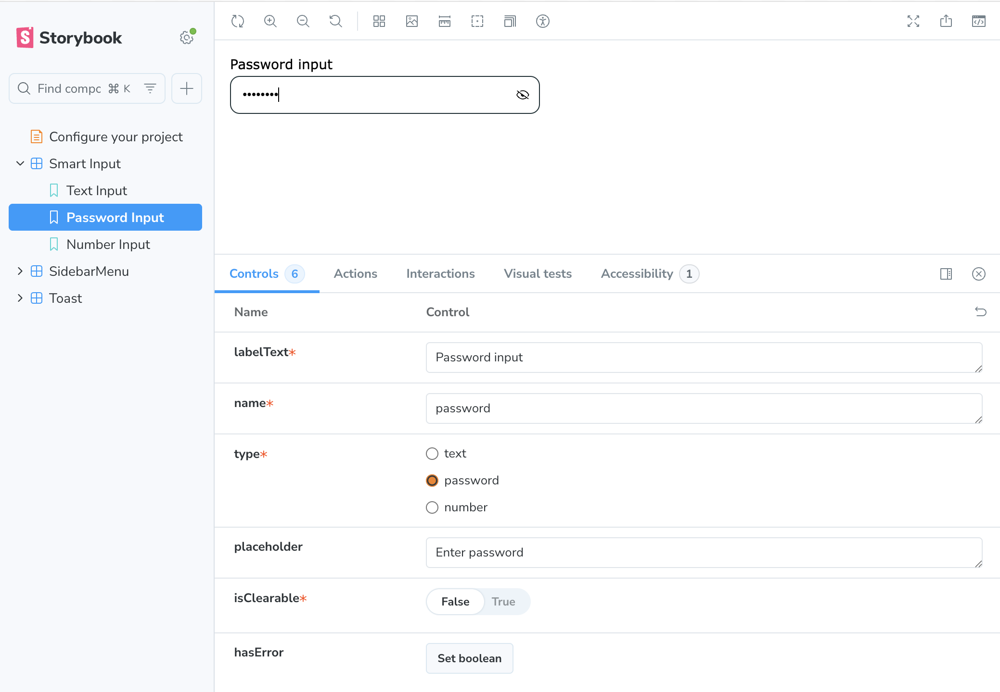
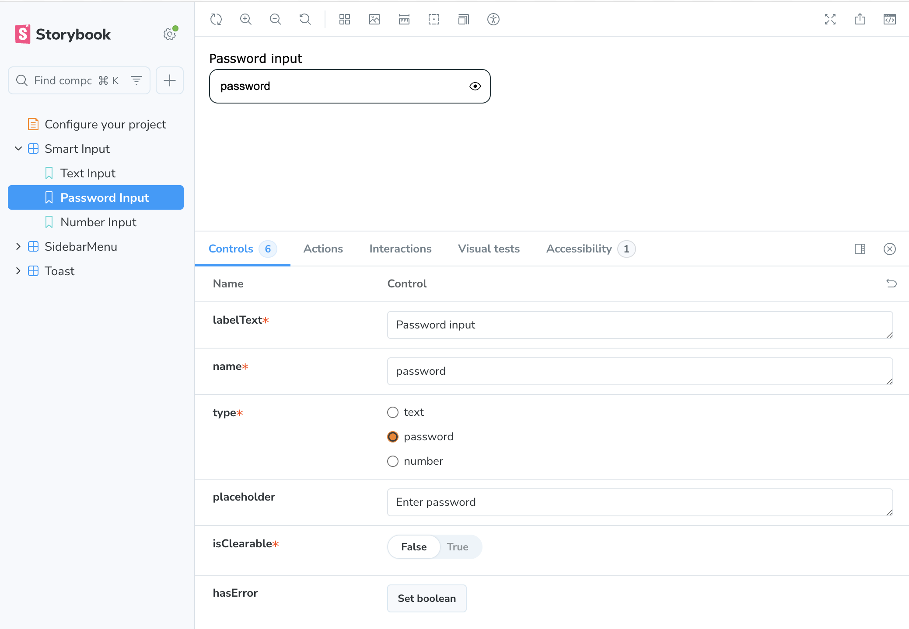
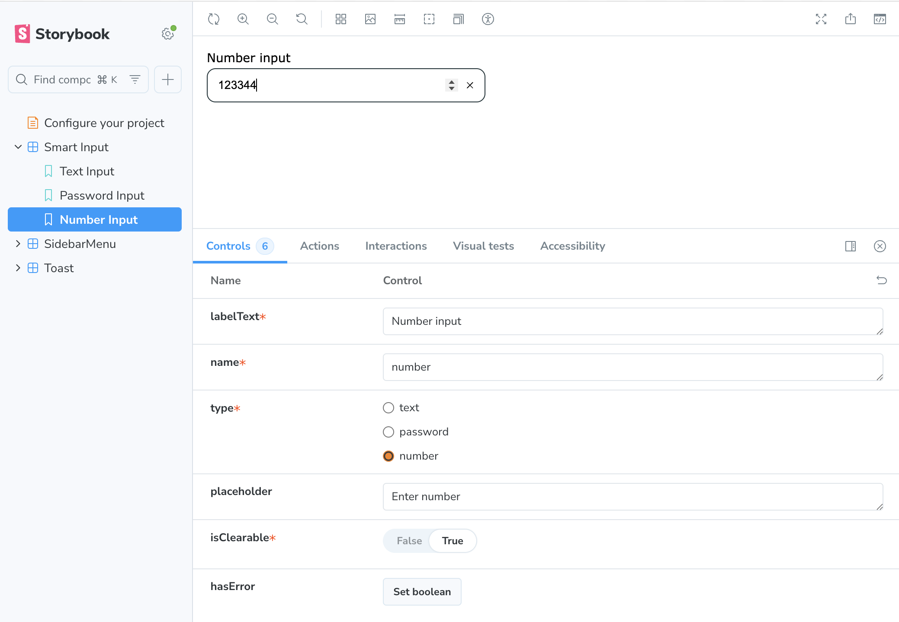
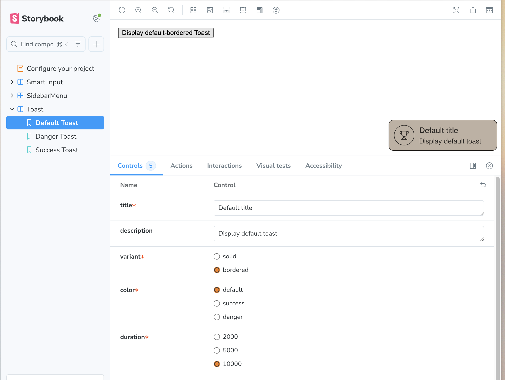
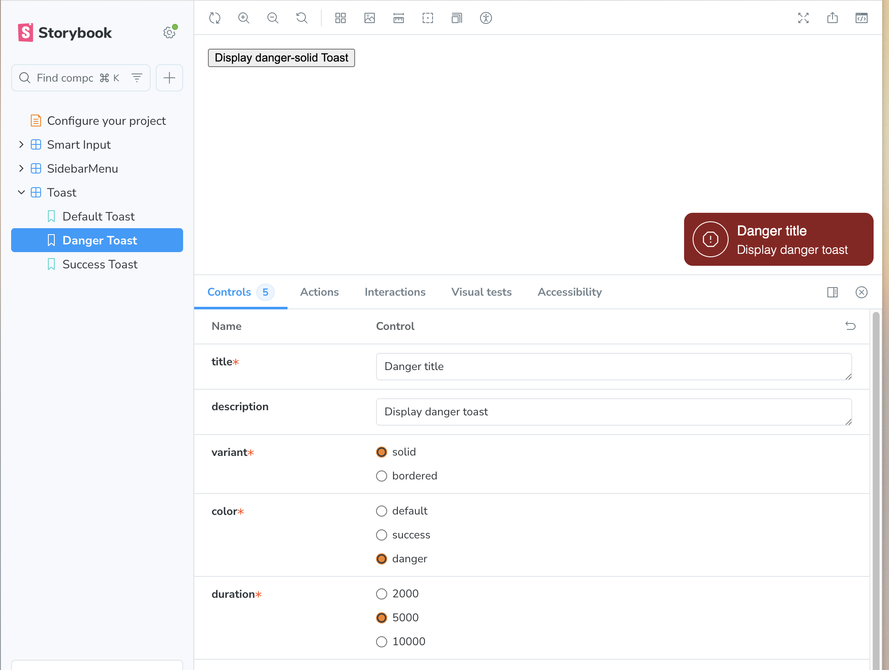
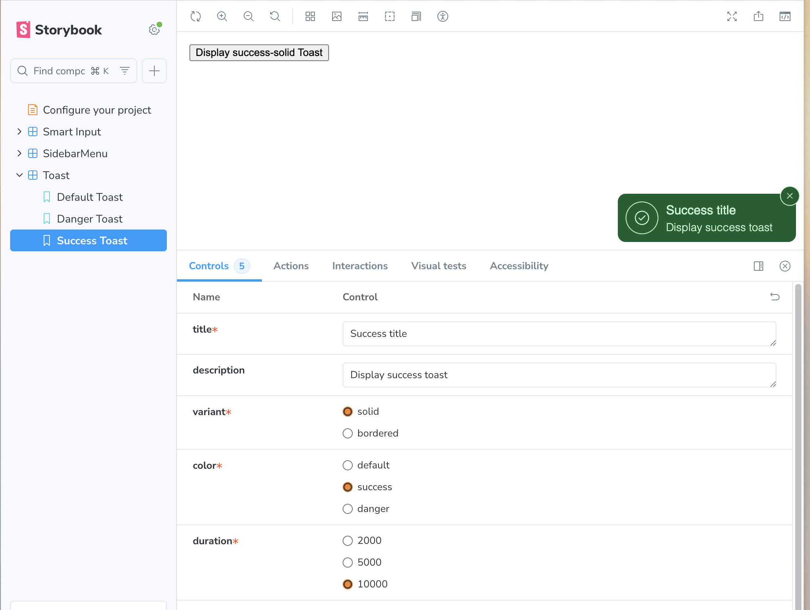
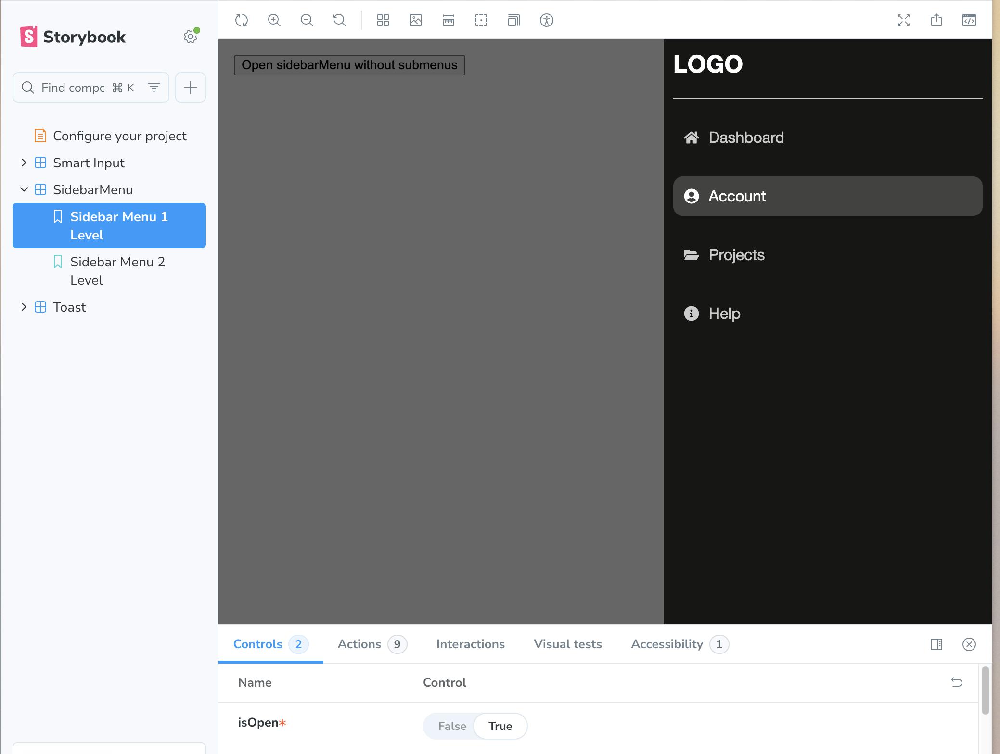
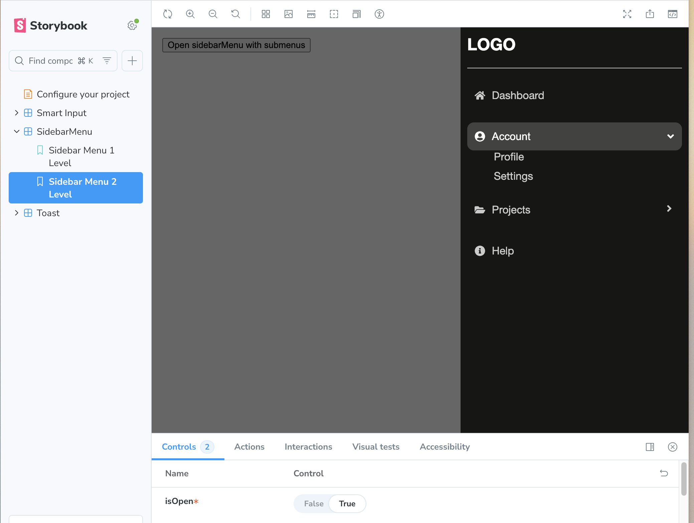

# Create a small React component library using Storybook.

## Setup & Run Instructions

### 1. Clone the repository

```bash
git clone git@github.com:yliubyva/tiny-react-kit.git
cd tiny-react-kit
```

### 2. Install dependencies

```bash
npm install
```

### 3. Start Storybook

```bash
npm run storybook
```

## Implemented Components

---

### 1. Smart Input Component






**Behavior:**

- Supports types: `text`, `password`, `number`.
- Password type includes an **eye icon** to toggle visibility.
- `isClearable={true}` shows a button to clear the input.
- Optional `hasError` state for error styling.

**Storybook Covers:**

- `TextInput`
- `PasswordInput`
- `NumberInput`

**Controls available:**

- `labelText`
- `name`
- `type` — `text | password | number`
- `placeholder`
- `isClearable` — `true | false`
- `hasError` — `true | false`

---

### 2. Toast Component





**Behavior:**

- Appears in the **bottom-right corner**.
- Auto-dismisses based on `duration`.
- Slide transition.
- Optional close button visible on hover.
- Visual variants: `solid`, `bordered`.
- Color types: `default`, `success`, `danger`.

**Storybook Covers:**

- `DefaultToast`
- `DangerToast`
- `SuccessToast`

**Controls available:**

- `title`
- `description`
- `variant` — `solid | bordered`
- `duration` — `2000 | 5000 | 10000`

---

### 3. Sidebar Menu




**Behavior:**

- Slides in from the **right**.
- Supports nested items via **accordion**.
- Closes when clicking the background overlay.
- Opened using a trigger button.

**Storybook Covers:**

- `Sidebar Menu — 1 level`
- `Sidebar Menu — 2 levels`

**Controls available:**

- `isOpen` — `true | false`

## I appreciate you taking the time to review my submission. 🐣
